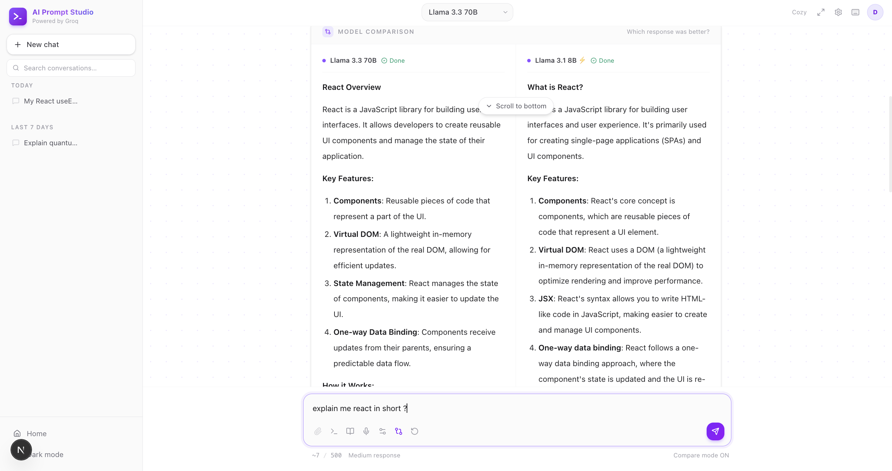
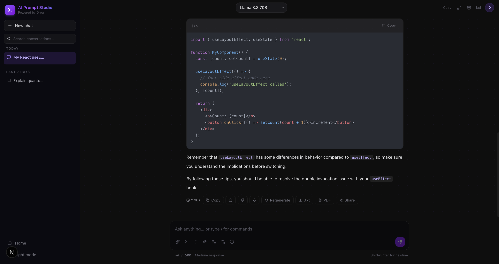
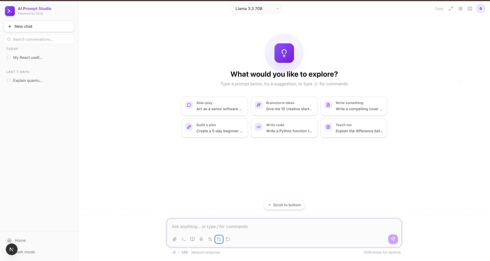
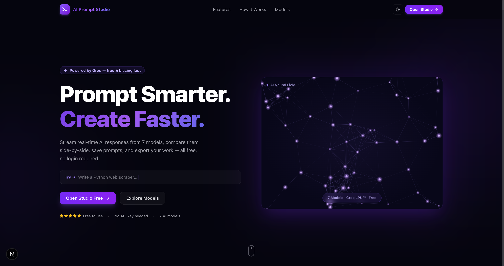

```
██████╗ ██████╗  ██████╗ ███╗   ███╗██████╗ ████████╗███████╗ ██████╗ ██████╗  ██████╗ ███████╗
██╔══██╗██╔══██╗██╔═══██╗████╗ ████║██╔══██╗╚══██╔══╝██╔════╝██╔═══██╗██╔══██╗██╔════╝ ██╔════╝
██████╔╝██████╔╝██║   ██║██╔████╔██║██████╔╝   ██║   █████╗  ██║   ██║██████╔╝██║  ███╗█████╗
██╔═══╝ ██╔══██╗██║   ██║██║╚██╔╝██║██╔═══╝    ██║   ██╔══╝  ██║   ██║██╔══██╗██║   ██║██╔══╝
██║     ██║  ██║╚██████╔╝██║ ╚═╝ ██║██║        ██║   ██║     ╚██████╔╝██║  ██║╚██████╔╝███████╗
╚═╝     ╚═╝  ╚═╝ ╚═════╝ ╚═╝     ╚═╝╚═╝        ╚═╝   ╚═╝      ╚═════╝ ╚═╝  ╚═╝ ╚═════╝ ╚══════╝
                                  AI  P R O M P T  S T U D I O
```

<div align="center">

# PromptForge — AI Prompt Studio

**A free, blazing-fast AI prompt studio in your browser. No sign-up. No API key needed. Just results.**

🌐 **Live Demo:** [ai-prompt-studio-ai.netlify.app](https://ai-prompt-studio-ai.netlify.app)


</div>

---

## Features

| | Feature | Description |
|---|---|---|
| ⚡ | **Real-Time Streaming** | Watch AI responses generate token by token, powered by Groq's LPU™ — up to 10× faster than GPU-based APIs |
| 🔀 | **Side-by-Side Compare** | Run one prompt against two models simultaneously and see exactly who wins |
| 📚 | **Prompt History** | Every conversation auto-saved locally — search, star, rename, and organise into folders |
| 🎛️ | **Tone Selector** | Switch between Precise, Balanced, and Creative modes; fine-tune response length |
| 🎤 | **Voice Input** | Speak your prompt via the Web Speech API — transcribed instantly, no third-party needed |
| 📌 | **Pin & React** | Pin key responses, rate answers with thumbs up/down, and keep context visible |
| 🔗 | **Share & Export** | Share via encoded link or export as `.txt`, Markdown, or PDF — no account required |
| 🌗 | **Dark & Light Mode** | Polished in both themes; preference persists automatically |
| 🔑 | **Bring Your Own Key** | Optionally use your own Groq API key — stored in `localStorage`, never sent to any server |

---

## How It Works

**1. 🖊️ Write your prompt**
Type (or speak) your prompt in the studio. Choose from 7 state-of-the-art models.

**2. ⚡ Stream the response**
Hit send — tokens stream in real time via Groq's LPU™ inference at up to 280 tok/s.

**3. 🔀 Compare & evaluate**
Switch to Compare Mode to run the same prompt on two models side by side.

**4. 💾 Save & share**
Pin responses, save prompts to your library, and export or share the entire conversation.

---

## Getting Started

```bash
# 1. Clone the repo
git clone https://github.com/dania-01/AI-Prompt-Studio.git
cd AI-Prompt-Studio

# 2. Install dependencies
npm install

# 3. Add your Groq API key
cp .env.example .env.local
# → set NEXT_PUBLIC_GROQ_API_KEY=your_key_here
#   (get a free key at https://console.groq.com)

# 4. Run the dev server
npm run dev
```

Open [http://localhost:3000](http://localhost:3000) — the studio is ready.

> **No key? No problem.** The app ships with a shared demo key so you can explore it right away.

---

## Folder Structure

```
src/
├── app/               # Next.js App Router (pages: /, /studio, /models)
├── components/        # Reusable UI (Tooltip, Sidebar, Modals, StreamingText…)
├── sections/
│   └── landing/       # Hero, Features, HowItWorks, Models, Footer
├── context/           # Global state — Prompt, Theme, Toast providers
├── hooks/             # useStreamingResponse, useCompare, usePromptHistory
├── utils/             # Groq client, export helpers, token counter
├── validation/        # Zod prompt schemas
└── styles/            # Design tokens (CSS custom properties)
```

---

## Screenshots

<table>
  <tr>
    <td align="center"><b>Landing Page</b></td>
    <td align="center"><b>Studio — Streaming Response</b></td>
  </tr>
  <tr>
    <td></td>
    <td></td>
  </tr>
  <tr>
    <td align="center"><b>Studio — Welcome Screen</b></td>
    <td align="center"><b>Compare Mode</b></td>
  </tr>
  <tr>
    <td></td>
    <td></td>
  </tr>
</table>

---

## What I Learned

**Streaming SSE** — Consuming Server-Sent Events from the Groq API via the native `fetch` + `ReadableStream` API, parsing chunks incrementally and updating React state token by token without re-rendering the entire message list.

**API Integration at the Edge** — Wiring a third-party LLM API directly from a Next.js client component using `NEXT_PUBLIC_*` env vars, handling abort signals for mid-stream cancellation, and gracefully recovering from network errors.

**Custom Hooks Architecture** — Separating streaming logic (`useStreamingResponse`), history management (`usePromptHistory`), and compare orchestration (`useCompare`) into focused hooks kept the page components thin and easy to test independently.

**Component-Driven UI** — Building an animated, scroll-driven features section (12 cards with direction-aware Framer Motion transitions), a canvas-based particle field animation, and a fully resizable sidebar with a portal-based dropdown — all without a UI library.

---

## Author

**Dania Khan**

[](https://www.linkedin.com/in/dania-khan-438751223/)
[](https://dania-portfolio04.netlify.app/)

---

<div align="center">

MIT License · Built with Next.js + Groq + Framer Motion

⭐ If you found this useful, consider starring the repo!

</div>
